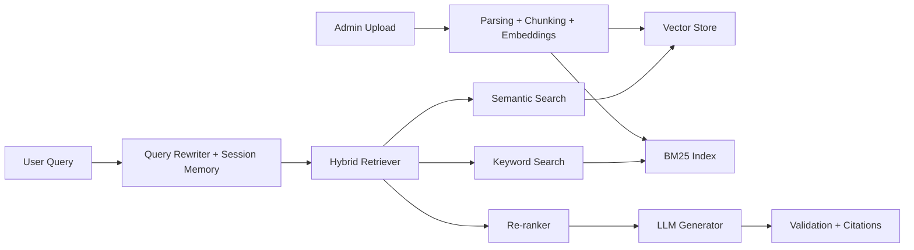

# Enterprise RAG QA Platform

Production-grade, resume-premium Retrieval-Augmented Generation (RAG) system for multi-document question answering with hybrid retrieval, reranking, citations, validation, and deployment-ready engineering.

## Why This Project Stands Out

Most student RAG projects stop at "upload PDF + chatbot". This repository is designed to signal **LLM engineering maturity**, **retrieval quality optimization**, **evaluation thinking**, and **product readiness**:

- Hybrid retrieval: semantic vector search + BM25 keyword search
- Re-ranking layer for higher precision evidence selection
- Multi-document ingestion across PDF, DOCX, and TXT
- Citation-first grounded generation
- Conversation memory and query rewriting
- Validation layer for hallucination reduction
- Evaluation metrics: Recall@K, MRR, faithfulness, answer relevance
- FastAPI backend + Streamlit admin and demo frontend
- Dockerized and ready for cloud deployment
- Clean modular architecture that can scale to Pinecone, Graph RAG, auth, and observability

## Tech Stack

- Python 3.11
- FastAPI
- Streamlit
- ChromaDB
- Sentence Transformers
- BM25
- OpenAI-compatible LLM interface
- Docker
- GitHub Actions

## Architecture



## Project Structure

```text
.
├── backend/
│   └── app/
│       ├── api/routes/
│       ├── core/
│       ├── llm/
│       ├── memory/
│       ├── models/
│       ├── retrieval/
│       ├── schemas/
│       ├── services/
│       └── storage/
├── frontend/
├── docs/
├── scripts/
├── tests/
├── data/
├── Dockerfile
├── docker-compose.yml
├── pyproject.toml
└── README.md
```

## Key Features

### Implemented in This Scaffold

- PDF, DOCX, and TXT ingestion
- Intelligent recursive chunking
- Sentence Transformer embeddings
- Chroma vector store
- BM25 keyword retrieval
- Reciprocal-rank-fusion hybrid retrieval
- Cross-encoder reranking
- OpenAI-compatible answer generation
- Inline citations and source excerpts
- Session memory
- Query rewriting
- Validation notes for groundedness review
- Evaluation module and tests

### Recommended Next Upgrades

- JWT auth and admin RBAC
- Redis caching
- Postgres or managed vector DB
- Observability with OpenTelemetry + Prometheus
- Graph RAG with extracted entities and relations
- Multi-tenant document collections
- Agentic retrieval retry and self-reflection

## Quick Start

```bash
python3 -m venv .venv
source .venv/bin/activate
pip install -e ".[dev]"
cp .env.example .env
make run-api
make run-ui
```

Open:

- API docs: `http://localhost:8000/docs`
- Frontend: `http://localhost:8501`

## What Makes It Resume-Grade

- It shows **applied retrieval engineering**, not just chatbot assembly.
- It includes **evaluation and benchmarking hooks**, which most student projects miss.
- It demonstrates **system design, modular APIs, and deployment readiness**.
- It supports a strong narrative for internships, GenAI roles, LinkedIn, GitHub, and MS applications.

## Benchmarking Strategy

Build a labeled dataset of `query -> relevant chunks -> expected answer` and compare:

1. Dense-only retrieval
2. BM25-only retrieval
3. Hybrid retrieval
4. Hybrid + reranking

Track:

- Recall@K
- MRR
- latency per stage
- answer relevance
- faithfulness

## Suggested Domain Variants

- Research assistant for scientific literature
- Healthcare policy QA assistant
- Legal clause and contract copilot
- Cybersecurity runbook retrieval assistant
- University knowledge assistant

## Documentation

- [Architecture](docs/ARCHITECTURE.md)
- [Implementation Guide](docs/IMPLEMENTATION_GUIDE.md)
- [Deployment Guide](docs/DEPLOYMENT.md)
- [Portfolio Strategy](docs/PORTFOLIO_STRATEGY.md)
- [Resume Assets](docs/RESUME_ASSETS.md)
- [Screenshot Guide](docs/SCREENSHOT_GUIDE.md)

## Portfolio Positioning

This project is ideal if you want your profile to communicate:

- LLM engineering
- applied AI architecture
- retrieval systems thinking
- production readiness
- measurable GenAI quality optimization

That combination is exactly what differentiates serious AI/ML candidates from average course-project portfolios.
