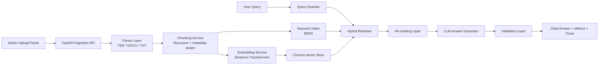

# Architecture

## System Design

## Enterprise Rationale

- Hybrid retrieval improves recall for exact terms, abbreviations, policies, and semantically paraphrased queries.
- Re-ranking raises precision at the final evidence layer and gives better source attribution quality.
- Query rewriting plus session memory support multi-turn enterprise knowledge workflows.
- Validation notes create a lightweight answer-quality guardrail and interview-friendly "hallucination reduction" story.
- The modular service layout supports future upgrades to Pinecone, pgvector, Graph RAG, SSO, audit logs, and observability.

